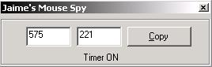



## Mouse Spy Example

### Description

This is a Mouse Spy Example. It will get the current X and Y values of your mouse cursor. It has a feature where you can stop the timer by pressing enter and copy the values to the clipboard.
 
### More Info
 

             |
---                |---
**Submitted On**   |2002-06-10 19:06:26
**By**             |[Jaime Muscatelli](https://github.com/Planet-Source-Code/PSCIndex/blob/master/ByAuthor/jaime-muscatelli.md)
**Level**          |Intermediate
**User Rating**    |3.0 (12 globes from 4 users)
**Compatibility**  |VB 6\.0
**Category**       |[Complete Applications](https://github.com/Planet-Source-Code/PSCIndex/blob/master/ByCategory/complete-applications__1-27.md)
**World**          |[Visual Basic](https://github.com/Planet-Source-Code/PSCIndex/blob/master/ByWorld/visual-basic.md)
**Archive File**   |[Mouse\_Spy\_965636192002\.zip](https://github.com/Planet-Source-Code/jaime-muscatelli-mouse-spy-example__1-36033/archive/master.zip)

